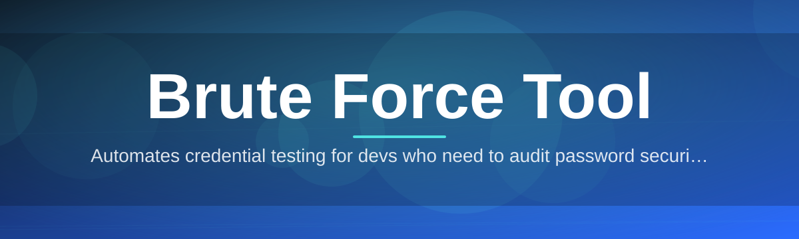
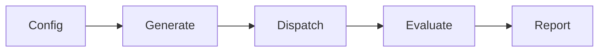

# brute-force-tool-suite 🔐⚙️

  

*A methodical, transparent engine for exhaustive credential and keyspace testing — built for people who need to know, not guess.*

  

## 🧭 Overview

Password recovery and credential auditing share a common bottleneck: the space of possible inputs is enormous, and manual testing simply does not scale. Whether you have locked yourself out of an archive, inherited a device with a forgotten passphrase, or need to verify that a login form actually resists sustained automated attempts, the underlying task is the same — systematically walk through a candidate space until a match is found or the space is exhausted.

**brute-force-tool-suite** exists to make that walk fast, observable, and reproducible. Rather than treating brute forcing as a black box, this project exposes every stage of the process — candidate generation, throughput tuning, and result verification — as a distinct, inspectable component. The result is a tool that behaves less like a blunt instrument and more like a lab bench: you configure the experiment, watch it run, and read the outcome.

This suite is aimed at security researchers running authorized audits, IT administrators recovering access to systems they own, digital forensics practitioners working within legal mandates, and hobbyists who simply want to understand how keyspace exhaustion behaves in practice. It assumes you have the right to test the target in question — the tool provides the mechanism, the responsibility for lawful use stays with the operator.

> [!IMPORTANT]
> This tool is designed for authorized testing, password recovery on your own systems, and educational research into credential security. Always confirm you have explicit permission before running any brute force session against a system you do not own.

---

## 🚀 What Sets This Engine Apart

1. **Adaptive throughput scaling** — the engine benchmarks the target's response latency during a short warm-up phase and adjusts request concurrency automatically, avoiding both wasted idle cycles and target-side throttling.

2. **Composable candidate generators** — wordlists, mask-based patterns, and rule-mutated dictionaries can be layered together, so a single session can blend a known wordlist with algorithmic permutations rather than forcing a choice between the two.

3. **Live session telemetry** — a real-time dashboard reports attempts per second, estimated time remaining, and a rolling success-probability curve, so long-running sessions are never a guessing game.

4. **Checkpointed resumability** — session state is persisted at configurable intervals, meaning a multi-day keyspace sweep can survive a reboot, a power loss, or a deliberate pause without losing progress.

5. **Protocol-aware modules** — separate handler modules understand the handshake quirks of different target types (archive formats, local login prompts, network services), so timing and retry logic are tuned per protocol rather than applied uniformly.

6. **Isolated attempt sandboxing** — each candidate test runs in its own lightweight execution context, preventing a single malformed attempt from stalling or corrupting the overall session.

7. **Structured result export** — matches, near-misses, and full attempt logs can be exported to CSV or JSON, useful for audit trails and downstream reporting.

8. **Rate-limit courtesy mode** — an optional throttle profile intentionally slows the engine to mimic human-paced attempts, useful when testing whether a target's own defenses correctly detect and respond to sustained probing.

> [!TIP]
> Start every session in courtesy mode. It is slower, but it gives you a clean read on whether the target has rate-limiting or lockout defenses before you switch to full-throughput testing.

---

## 🏁 Getting Started

1. Visit the project landing page linked in the download button above.

2. Download the latest standalone build for Windows — no installer wizard, no bundled extras.

3. Run the executable directly. Windows SmartScreen may prompt on first launch since the binary is not signed by a large publisher; this is expected for an independently maintained tool.

4. Configure your session — target type, candidate source, and throughput profile — then start the run from the main dashboard.

---

## 💻 System Requirements

| Component | Minimum | Recommended |
|---|---|---|
| OS | Windows 10 (64-bit) | Windows 11 (64-bit) |
| RAM | 4 GB | 8 GB+ |
| Storage | 150 MB free | 500 MB free (for large wordlists) |
| Dependencies | None — fully standalone | None |
| Network | Only required for remote-target sessions | Stable connection recommended |

> [!NOTE]
> The suite ships as a single self-contained binary. There is nothing to compile, no runtime to install separately, and no background service left behind after you close it.

---

## 🧩 How It Works

The engine follows a deliberately linear pipeline so that each stage can be reasoned about, logged, and — if needed — paused independently of the others.

1. **Configuration parsing** — your chosen target, candidate source, and throughput profile are validated and compiled into an internal session plan.

2. **Candidate generation** — the appropriate generator (wordlist reader, mask expander, or rule engine) begins streaming candidates rather than loading the entire keyspace into memory at once.

3. **Dispatch and testing** — candidates are dispatched to the protocol handler in adaptively-sized batches, with each attempt sandboxed and timed.

4. **Result evaluation** — responses are scored against the success condition; matches trigger an immediate session halt and export, non-matches feed back into throughput tuning.

5. **Checkpoint and reporting** — progress is checkpointed on an interval, and a final report is generated whether the session ends in a match, exhaustion, or manual stop.

---

## 🛟 Troubleshooting

**Q: The session reports zero attempts per second after startup.**
A: This usually means the target handler is stuck waiting on a handshake. Check that the target address or file path is correct and that the protocol module matches the target type.

**Q: Windows flagged the executable on first run.**
A: This is standard SmartScreen behavior for unsigned independent binaries. Verify the download came from the official landing page, then choose "Run anyway" if you trust the source.

**Q: My session was interrupted by a reboot — is progress lost?**
A: No. Checkpointing runs automatically at the interval set in your session profile. Relaunch the tool and select "Resume Session" from the startup screen.

**Q: Throughput dropped sharply partway through a long run.**
A: The adaptive scaler likely detected increased latency or throttling from the target and backed off intentionally to avoid lockouts. This is expected behavior, not a fault.

**Q: Can I run multiple sessions at once?**
A: Yes, each session runs in an isolated context, but be mindful of combined CPU and network load — running too many concurrently will slow all of them down.

**Q: The export file is empty even though the run completed.**
A: Confirm the export path set in Settings has write permissions. The tool will not silently fail, but permission errors are sometimes swallowed by antivirus sandboxing.

---

## 🎨 UI / UX Details

<strong>Keyboard shortcuts</strong>

| Shortcut | Action |
|---|---|
| `Ctrl + N` | New session |
| `Ctrl + S` | Save current session profile |
| `Space` | Pause / Resume active run |
| `Ctrl + E` | Export current results |
| `Ctrl + L` | Toggle live log panel |
| `F1` | Open in-app help |

<strong>Themes and appearance</strong>

The dashboard ships with a light theme, a dark theme, and a high-contrast accessibility theme. Theme selection is saved per-user in the local settings file and applies instantly without a restart.

<strong>Session settings</strong>

- Throughput profile: Courtesy, Balanced, Maximum

- Checkpoint interval: configurable from 30 seconds to 30 minutes

- Notification on completion: desktop toast, sound, or silent

- Log verbosity: Minimal, Standard, Verbose

> [!WARNING]
> Maximum throughput mode is CPU and network intensive. On shared networks, coordinate with your network administrator before running sustained high-throughput sessions.

---

## 🤝 Contributing & Community

Contributions are welcome, particularly around new protocol handler modules and candidate generation strategies. Before opening a pull request, please open an issue describing the proposed change so it can be discussed against the project's architecture.

- Bug reports and feature requests: use the Issues tab with the provided templates.

- Discussion of methodology, benchmarks, and use cases: use the Discussions tab.

- Please review the Code of Conduct before participating in any project space.

 

> [!NOTE]
> This is a community-maintained project. Response times on issues may vary, but every report is read and triaged.

---

## 📜 License

Released under the [MIT License](LICENSE), 2026. You are free to use, modify, and redistribute this software in accordance with the license terms.

---

## ⚖️ Disclaimer

This software is provided for lawful security research, authorized penetration testing, and personal password recovery on systems and accounts you own or are explicitly authorized to test. The maintainers of this project accept no responsibility for misuse. Users are solely responsible for ensuring their activities comply with applicable laws and regulations in their jurisdiction.

